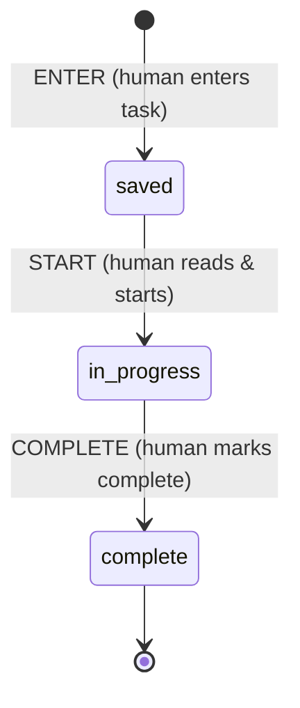

# Task list state machine

v0: the smallest lifecycle. A human enters a task and it is saved; later a
human reads it and starts work; then they mark it complete. Every transition
is human-driven.

| Event      | From          | To            | Actor |
|------------|---------------|---------------|-------|
| `ENTER`    | ∅ (new task)  | `saved`       | human |
| `START`    | `saved`       | `in_progress` | human |
| `COMPLETE` | `in_progress` | `complete`    | human |

Any other event/state pair is rejected.

## Files

- `machine.js` — the definition (states, transitions, `transition()`, `available()`).
  The diagram page and tests both read it, so it is the source of truth.
- `index.html` — diagram plus a simulator; open it next to `machine.js`.
- `machine.test.js` — `node --test machine.test.js`
