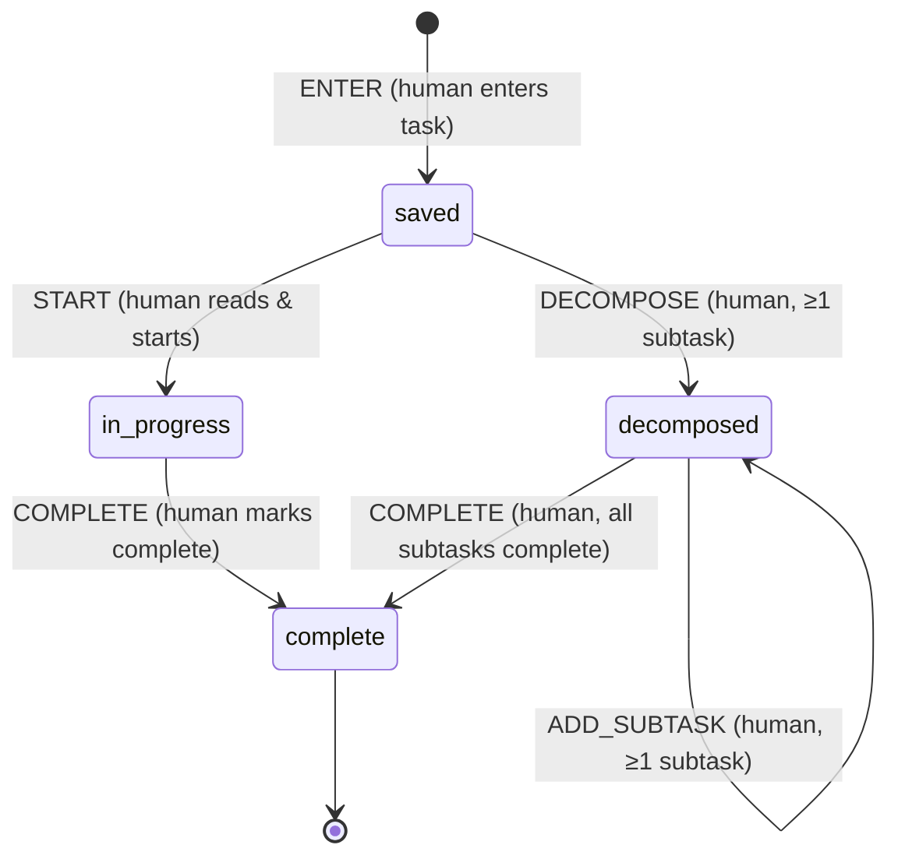

# Task list state machine

v1: a human enters a task and it is saved. Later a human reads it and either
works it directly, or decomposes it into subtasks first. A decomposed task
waits until all of its subtasks are complete, then a human marks it complete.
Every transition is human-driven.

| Event         | From          | To            | Only if                | Actor |
|---------------|---------------|---------------|------------------------|-------|
| `ENTER`       | ∅ (new task)  | `saved`       |                        | human |
| `START`       | `saved`       | `in_progress` |                        | human |
| `COMPLETE`    | `in_progress` | `complete`    |                        | human |
| `DECOMPOSE`   | `saved`       | `decomposed`  | at least one subtask   | human |
| `ADD_SUBTASK` | `decomposed`  | `decomposed`  | at least one subtask   | human |
| `COMPLETE`    | `decomposed`  | `complete`    | all subtasks complete  | human |

Any other event/state pair is rejected.

Subtasks are ordinary tasks. Each is created with `ENTER` and runs this same
machine, so a subtask can be decomposed again. The parent's guard checks only
its direct subtasks. That is enough, because a subtask can't be complete until
its own subtasks are.

Guards read a context the caller passes to `transition(state, event, ctx)`:
`newSubtasks` (how many subtasks the event creates) and `childStates` (the
current states of the task's direct subtasks).

## Files

- `machine.js`: the definition (states, transitions, guards, `transition()`,
  `check()`, `available()`). The diagram page and tests both read it, so it is
  the source of truth.
- `index.html`: diagram plus a simulator with nested subtasks. Open it next to `machine.js`.
- `machine.test.js`: run with `node --test machine.test.js`.
