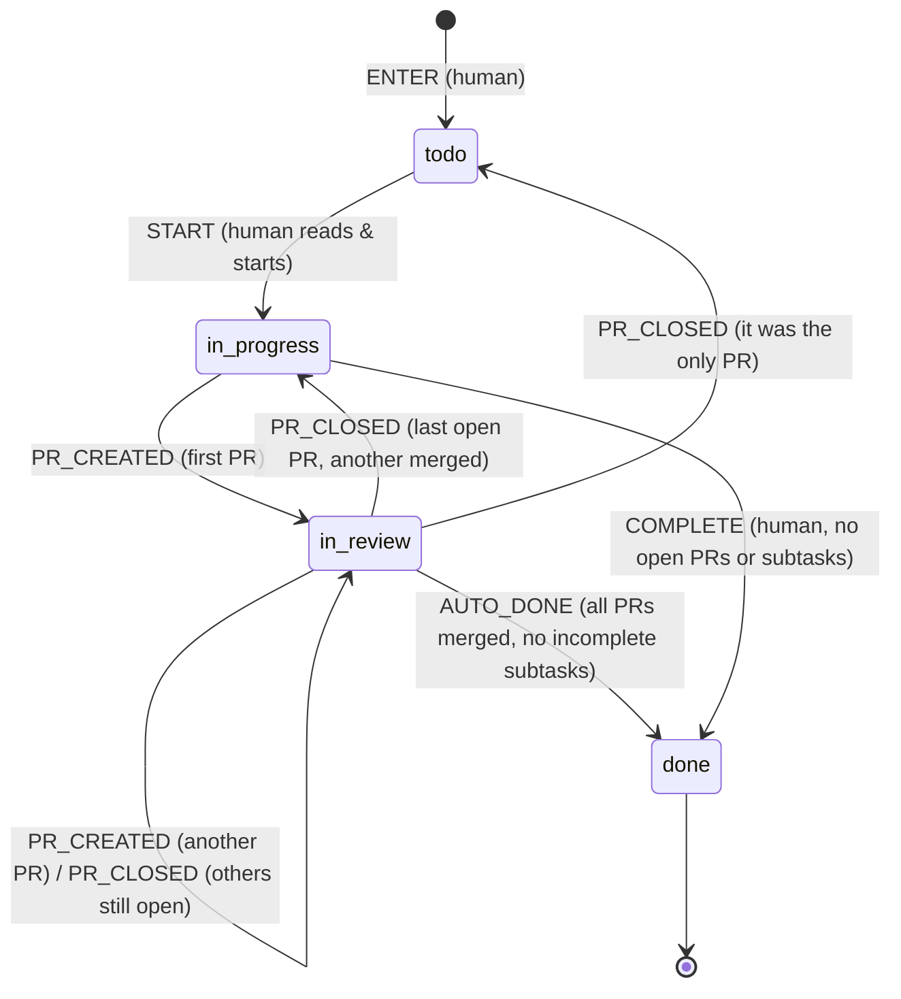

# Task list state machine

v6: a human enters a task and it is **todo**. A human reads it and starts it
(**in_progress**). Creating a PR moves it to **in_review**, and more PRs can be
linked while it's there. When every linked PR is merged and every subtask is
done, the task moves to **done** automatically, and that can finish its parent
in turn. Closed PRs are ignored.

At any point before done, a human can **decompose** a task into subtasks.
Decompose is an action against the task, not a status change: the task becomes
a parent and keeps whatever status it had.

`DECOMPOSE` is allowed in `todo`, `in_progress` and `in_review` and never
changes status.

**Done means every linked PR merged and every subtask done** (`readyForDone`).
Closed PRs count for neither. Two paths lead there:

- `AUTO_DONE`: nobody fires it. After a PR merges or a subtask finishes, the
  caller asks `settle(state, ctx)`, which returns `AUTO_DONE` when the task is
  in review and ready. A task finishing then settles its parent.
- `COMPLETE`: a human marks a task done from `in_progress`. This is for tasks
  that never get a PR, such as a parent that only groups subtasks.

**Closing a PR** (`PR_CLOSED`, with the closed PR included in `prStatuses`):
if other PRs are still open, nothing changes. If none are open and one has
merged, the task goes back to `in_progress`. If it was the only PR, the task
goes back to `todo`.

Subtasks are ordinary tasks. Each is created with `ENTER`, so new subtasks
always start in `todo`, whatever status the parent is in. They run this same
machine, so a subtask can be decomposed again.

Guards read a context the caller passes to `transition(state, event, ctx)`:
`newSubtasks`, `childStates` (direct subtasks' statuses) and `prStatuses`
(linked PRs' statuses from `pr-machine.js`).

## The PR, while a task is in review

A task in `in_review` has at least one open PR, and each PR runs its own machine
(`pr-machine.js`), seen from the author's side. The PR stores three facts, and
its status is derived from them. The first match wins:

| Status            | When                                   |
|-------------------|----------------------------------------|
| `ci_failed`       | the latest CI run failed               |
| `has_feedback`    | there are unresolved review comments   |
| `accepted`        | a reviewer marked it accepted          |
| `awaiting_review` | otherwise (this is where a new PR starts) |
| `merged`          | final; counts toward the task's done   |
| `closed`          | final; the task ignores it             |

| Event               | Changes             | Who      |
|---------------------|---------------------|----------|
| `NEW_COMMITS`       | ci = pending (new CI run); fixes `ci_failed` | author |
| `CI_PASSED`         | ci = passed, only while pending | CI |
| `CI_FAILED`         | ci = failed, only while pending | CI |
| `COMMENT_ADDED`     | openComments + 1    | reviewer |
| `COMMENT_REPLIED`   | openComments − 1; fixes `has_feedback` | author |
| `ACCEPTED`          | accepted = true     | reviewer |
| `MERGED`            | merged = true (only when `accepted`) | author |
| `CLOSED`            | closed = true       | author   |

The author resolves `ci_failed` by pushing new commits, which start a new CI
run, and resolves `has_feedback` by replying to each comment. Because the
status is derived, "new commits pushed and every comment replied to" returns the PR
to `awaiting_review` by itself, or to `accepted` if it was accepted earlier. CI
and feedback outrank accepted. Only an accepted PR can merge. Nothing is
allowed on a merged or closed PR.

## Files

- `machine.js`: the definition. `transitions` are status changes and `actions`
  (DECOMPOSE) leave status unchanged. It also has the guards, `transition()`,
  `check()`, `available()` and `hasIncompleteChildren()`. The diagram page and
  tests both read it, so it is the source of truth.
- `pr-machine.js`: the PR facts, events and `status()` priority. `outcomes()`
  lists, per status, each event and the statuses it can lead to; the map uses it.
- `index.html`: a lifecycle map (one band per loop, one column per status, with
  the actions available in each) generated from both machines, plus a simulator with nested subtasks. Open it next to `machine.js`.
- `machine.test.js`, `pr-machine.test.js`: run with `node --test`.
