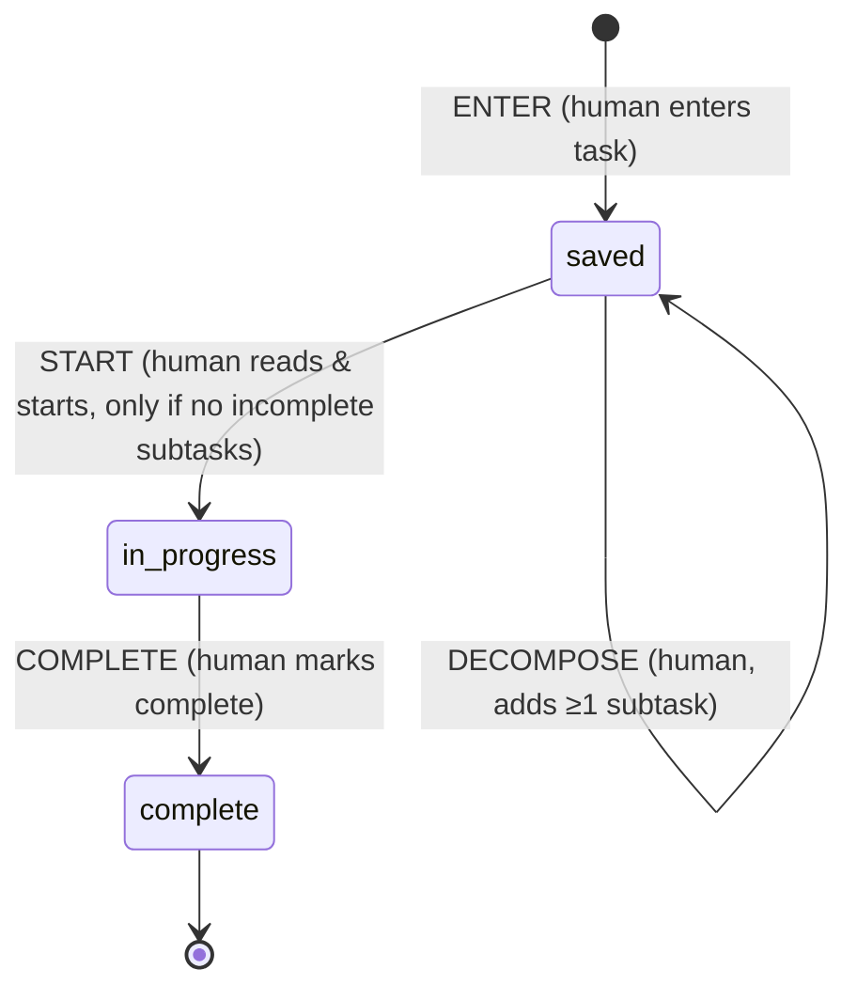

# Task list state machine

v2: a human enters a task and it is saved. Before starting it, a human can
decompose it into subtasks. Decompose is an **action on the task, not a
state**: the task stays `saved` and gains subtasks. "Has incomplete subtasks"
is a derived condition, computed from the subtasks' own states. A task can't
be started while that condition holds. Every transition is human-driven.

| Event       | From          | To            | Only if                  | Actor |
|-------------|---------------|---------------|--------------------------|-------|
| `ENTER`     | ∅ (new task)  | `saved`       |                          | human |
| `DECOMPOSE` | `saved`       | `saved`       | at least one new subtask | human |
| `START`     | `saved`       | `in_progress` | no incomplete subtasks   | human |
| `COMPLETE`  | `in_progress` | `complete`    |                          | human |

Any other event/state pair is rejected.

Subtasks are ordinary tasks. Each is created with `ENTER` and runs this same
machine, so a subtask can be decomposed again. `DECOMPOSE` can repeat to add
more subtasks. A task's guard checks only its direct subtasks. That is enough,
because a subtask can't be complete until its own subtasks are.

Guards read a context the caller passes to `transition(state, event, ctx)`:
`newSubtasks` (how many subtasks the event creates) and `childStates` (the
current states of the task's direct subtasks). `hasIncompleteChildren(ctx)`
exposes the derived condition.

## Files

- `machine.js`: the definition (states, transitions, guards, `transition()`,
  `check()`, `available()`, `hasIncompleteChildren()`). The diagram page and
  tests both read it, so it is the source of truth.
- `index.html`: diagram plus a simulator with nested subtasks. Open it next to `machine.js`.
- `machine.test.js`: run with `node --test machine.test.js`.
