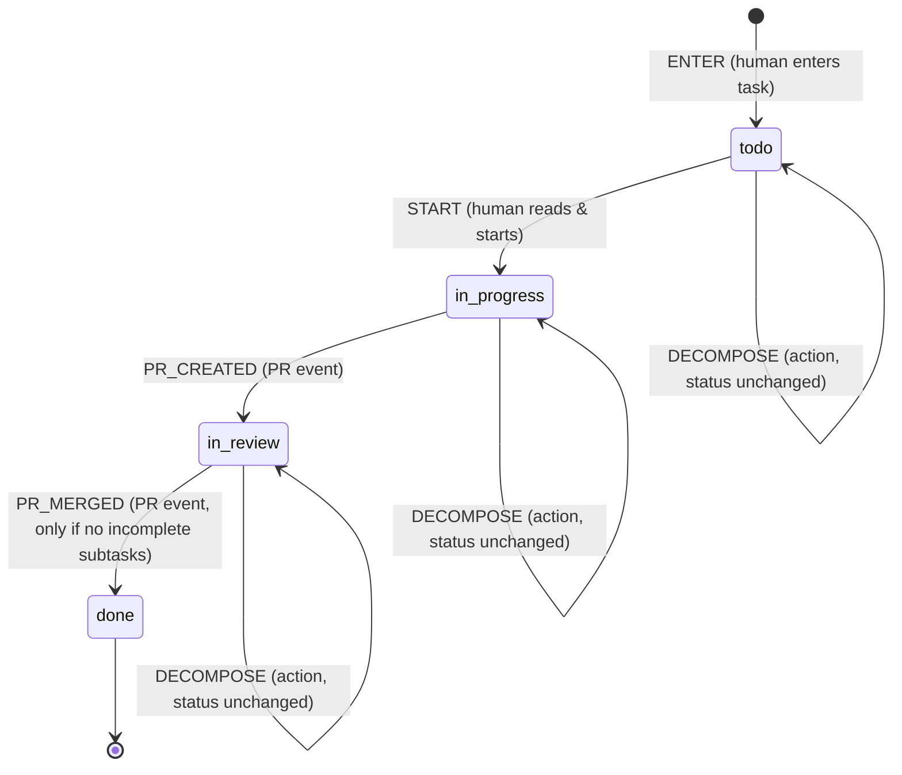

# Task list state machine

v4: a human enters a task and it is **todo**. A human reads it and starts it
(**in_progress**). Creating a PR moves it to **in_review**, and merging that PR
moves it to **done**.

At any point before done, a human can **decompose** a task into subtasks.
Decompose is an action against the task, not a status change: the task becomes
a parent and keeps whatever status it had. Being a parent is not a status
either. "Has incomplete subtasks" is derived from the subtasks' own statuses,
and a task can't move to done while it holds.

| Event        | From                               | To            | Only if                  | Actor    |
|--------------|------------------------------------|---------------|--------------------------|----------|
| `ENTER`      | ∅ (new task)                       | `todo`        |                          | human    |
| `START`      | `todo`                             | `in_progress` |                          | human    |
| `PR_CREATED` | `in_progress`                      | `in_review`   |                          | PR event |
| `PR_MERGED`  | `in_review`                        | `done`        | no incomplete subtasks   | PR event |
| `DECOMPOSE`  | `todo`, `in_progress`, `in_review` | unchanged     | at least one new subtask | human    |

Any other event/status pair is rejected. Nothing is allowed on a done task, and
work can't skip review.

Subtasks are ordinary tasks. Each is created with `ENTER` and runs this same
machine, so a subtask can be decomposed again. `DECOMPOSE` can repeat to add
more subtasks. A task's guard checks only its direct subtasks. That is enough,
because a subtask can't be done until its own subtasks are.

Guards read a context the caller passes to `transition(state, event, ctx)`:
`newSubtasks` (how many subtasks the event creates) and `childStates` (the
current statuses of the task's direct subtasks). `hasIncompleteChildren(ctx)`
exposes the derived condition.

## Files

- `machine.js`: the definition. `transitions` are status changes and `actions`
  (DECOMPOSE) leave status unchanged. It also has the guards, `transition()`,
  `check()`, `available()` and `hasIncompleteChildren()`. The diagram page and
  tests both read it, so it is the source of truth.
- `index.html`: diagram plus a simulator with nested subtasks. Open it next to `machine.js`.
- `machine.test.js`: run with `node --test machine.test.js`.
