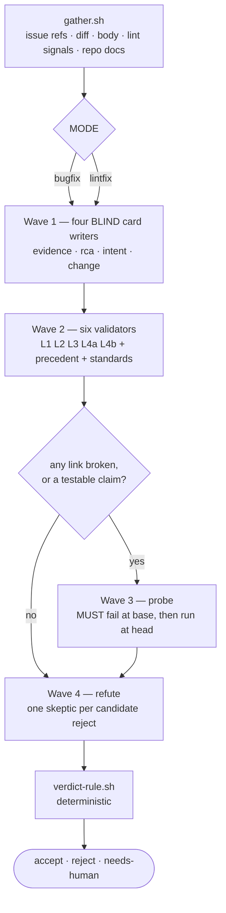

# autofix-review

One question, asked properly:

> Does this change do the job that the evidence, the root-cause analysis, and its
> own description say it does?

Not "is this good code". Not "what else could go wrong". A fix is a claim with a
paper trail behind it — an issue that says what broke, an analysis that says why,
a description that says what was done about it — and this skill checks that the
trail actually connects end to end.

The output is one of `accept`, `reject`, `needs-human`. It is meant to be trusted
without re-reading the diff, so **both `accept` and `reject` have to be earned**
and `needs-human` is what happens when neither is. That trade is deliberate: it
costs recall to protect the thing that makes a verdict worth having.

## The chain

```
evidence ──L1──▶ rca ──L2──▶ intent ──L3──▶ change
    └───────────── L4: does it actually stop? ──────┘
```



## Step 1 — gather (one call, no judgement)

```bash
scripts/gather.sh [<pr-url|pr-number|branch>] [--repo owner/name] [--repo-path <dir>]
```

`eval` its output. It writes every raw input under `$WORK` and decides `MODE`
(`bugfix` or `lintfix`) from the title, the diff and whether an issue is linked.
Keep `WORK`, `MODE`, `BASE_SHA`, `HEAD_SHA`, and the `*_FILE` paths.

It degrades rather than failing: no `gh`, no reachable PR, no linked issue — each
becomes an entry in `UNAVAILABLE`, which the verdict rule knows how to handle.
**Do not work around a missing input by inferring it.** A review anchored to an
issue you guessed at produces a confident verdict about the wrong bug.

`EVIDENCE_SOURCE` says where the evidence card has to come from: `issue` (a
tracker), `pr-body` (a `## Bug` section, a pasted stack trace, a repro — real
evidence, but the author wrote both it and the intent, so `L1` largely collapses
and the probe matters more; see `reference/cards.md`), or `none`, which is `N1`.

## Step 2 — Wave 1: four blind card writers

Four `Agent` calls **in one message**. Read `reference/cards.md` for the schemas;
each writes one JSON file to `$WORK/cards/`.

| Agent | Prompt contains | Writes |
|---|---|---|
| evidence | `$REFS_FILE` + fetched issue (sentry MCP); or `$BODY_EV_FILE` when `EVIDENCE_SOURCE=pr-body`; or in lintfix mode the rule id from `$LINT_FILE` plus its docs | `cards/evidence.json` |
| rca | the Seer/root-cause analysis for that issue | `cards/rca.json` |
| intent | `$BODY_FILE` **and `$DIVERGENCE_FILE`**, nothing else | `cards/intent.json` |
| change | `$DIFF_FILE` + read access to the repo, nothing else | `cards/change.json` |

**Blindness is enforced by what you put in the prompt, not by asking a subagent
to ignore something.** A `change` writer that has seen the PR body will describe
the diff in the body's own words, and then L3 compares a text with a paraphrase
of itself and holds every time. That single mistake silently disables the check
most likely to catch a real problem. Give each writer its own input and nothing
else.

Model: `sonnet` is enough for all four — this is extraction against a fixed
schema, not judgement.

## Step 3 — Wave 2: six validators

Six more `Agent` calls in one message. Each link validator gets **exactly two
cards** (paste the JSON into the prompt) plus repo read access, answers one
question, and writes `$WORK/links/<id>.json`.

| Agent | Gets | Asks |
|---|---|---|
| `L1` | evidence + rca | Does the RCA's mechanism explain this evidence? Are its `faulty_locations` on the trace? |
| `L2` | rca + intent | Does what the author says they did address that mechanism? If it diverges, does the body say why? |
| `L3` | intent + change | Does the diff do what the description claims — nothing missing, nothing extra? |
| `L4a` | evidence + change | **Prove the reported failure can no longer happen.** |
| `L4b` | evidence + change | **Prove the reported failure can still happen.** |
| `P` | `$FILES_FILE` + git log | Find 2–5 recent commits that fixed this shape of thing well. Does this diff take the same **shape**? |
| `S` | `$DOCS_FILE` + the diff hunks | Which repo rules govern the *changed lines*? Quote each one. Followed or not? |

`L4a` and `L4b` are the same question under opposed framings, and running both is
the cheapest guard there is against a model talking itself into whichever answer
it was pointed at. **If they disagree, that is `N2` and a human's call** — never
pick the more convincing one.

Three rules to put in every validator's brief:

1. **`unsupported` is a respectable answer.** It is the right one far more often
   than it feels. Never guess to avoid it.
2. **`broken` requires a citation** — `file.tsx:120`, or a named card field.
   `verdict-rule.sh` discards an uncited `broken` without ceremony.
3. **Judge only what the two cards in front of you say.** Do not go looking for
   other problems; that is a different skill.

For `P`: diverging from precedent is *context*, never a reject by itself. But be
exact about what `verdict` means — **it is about the shape this diff takes, not
about whether its core idea is the same one.** A change can reach the same
outcome as every prior while implementing it differently, and that is `diverges`.
Getting this wrong is not cosmetic: `verdict-rule.sh` reads the field and not
your note, and `matches` + a violated standard routes to `N5` (the written rule
and the lived practice disagree) where `diverges` + the same violation lets the
`R5` stand. Put the nuance in the field, then explain it in `note`.

For `S`: a rule broken by code the diff merely sits next to is not this change's
problem, and an unquotable standard is one you invented. Check the rule's own
scope before applying it — a rule written about one situation, cited against a
different one, is the most common way a false `R5` gets made.

## Step 4 — Wave 3: probe the closing link

Read `reference/probes.md` before writing anything. The rule that matters:

> **The probe must FAIL against base.** A probe that passes before the change
> measured nothing.

Derive the test from `cards/evidence.json` and `cards/rca.json` — preconditions
are the arrange, the mechanism is the act, the symptom is the assert. Do **not**
read the diff to decide what to test; that inverts the exercise into checking
that the change does what it does.

```bash
scripts/probe-run.sh --work "$WORK" --id p1 --test <probe-file> \
    --runner 'pnpm jest --silent {}' --repo-path <clone>
```

Outcomes: `proven` (fail→pass), `proven-reject` (fail→fail, the strongest finding
available), `invalid` (passed at base — discard it and mark `L1` unsupported),
`unprovable` (never ran).

Skip the wave entirely when `change.behavioral` is `false`, or when the evidence
has no reproducible precondition. Say `unprovable` up front rather than faking a
condition into existence and then proving your own fake.

**The scope guard:** a probe may only test a scenario named in a card. Not the
empty-array case you thought of on the way past. That work is real and belongs to
`/deep-pr-review`; done here it inflates the reject rate with findings unrelated
to the question this verdict answers.

## Step 5 — Wave 4: refute

For every link that came back `broken`, spawn one `Agent` whose job is to **kill
the finding**:

> Default to `refuted`. Open the files. Prove the reviewer wrong. Only report
> `survived` after you have tried and failed, and cite what you read.

Write `$WORK/refutations/<id>.json`. A `survived` with no citations is treated as
`refuted` — a skeptic who agreed without looking has told you nothing. Findings
already `proven-reject` by a probe skip this wave; the failing test *is* the
refutation attempt, and it lost.

## Step 6 — the verdict

```bash
scripts/verdict-rule.sh --work "$WORK" [--read-only]
```

Deterministic, and it is the decision — do not re-derive it in prose or overrule
it because the diff "feels" fine. `--read-only` is for scoring runs where the
probe wave could not run; it relaxes the probe requirement and labels the result
`SCORED=read-only` so it is never averaged in with fully-scored verdicts.

`reference/taxonomy.md` is the closed set of reject codes (`R1`–`R7`) and
needs-human codes (`N1`–`N5`). **Nothing outside that list is a reject** — not as
a minor one, not as a note attached to an accept.

## Step 7 — report

Short. Every line load-bearing.

```
VERDICT: reject (R4)          <- or accept / needs-human (N2)
Scored:  full                 <- or read-only

Chain:   L1 holds · L2 holds · L3 holds · L4 broken
Probe:   p1 fail@base -> fail@head (proven-reject)

R4  Incomplete — the trace names three call sites; the diff guards one.
    static/app/views/foo/bar.tsx:88 guarded
    static/app/views/foo/baz.tsx:12 unguarded  (evidence.failing_frames[1])
    static/app/views/foo/qux.tsx:31 unguarded  (evidence.failing_frames[2])
    Refuter tried the argument that baz/qux are unreachable; the router at
    routes.tsx:210 mounts both.

Precedent: matches (abc1234 used the same early-return shape)
Standards: followed
```

Then stop. No "you may also want to", no severity essay, no list of things that
were fine. If you noticed something outside the chain, it goes under a single
`Observations:` line, clearly outside the verdict, or into `/deep-pr-review`.

On `needs-human`, say precisely what a person has to decide and what you would
need to decide it yourself.

## What this skill does not do

| Not this | Use instead |
|---|---|
| Edge cases the evidence doesn't name | `/deep-pr-review` |
| Style, naming, formatting | `/frontend-conventions` |
| Open-ended bug hunting | `/code-review` |
| Posting the verdict to GitHub | `/local-pr-review` (it owns the body-approval gate) |
| Fixing what it finds | `/simplify`, or just fix it yourself |

It also never posts anything. It produces a verdict; publishing one is a
different act with a different safety story, and `local-pr-review` already owns
it.

## Scripts

| script | does |
|---|---|
| `gather.sh` | Wave 0 — every raw input, plus `MODE`; writes `$WORK` |
| `extract.sh` | the pure parsing (issue refs, lint signals, mode, doc discovery); sourced |
| `probe-run.sh` | one probe against base and head, with the base-must-fail gate |
| `verdict-rule.sh` | the deterministic accept/reject/needs-human rule; sourced by its tests |
| `eval/*.sh` | the precision harness — see `eval/README.md` |
| `test.sh` | every test in this skill, in one call |

Tests: `scripts/test.sh` runs all seven — `extract`, `verdict-rule`,
`eval/label`, `eval/collect` (pure, no repo); `gather`, `probe-run`,
`eval/fixtures` (real throwaway repos, no network, no `gh`). Run it before
touching the taxonomy, the verdict rule, or the probe gate: those three are the
precision surface, and a change that loosens one of them is exactly the kind
that looks harmless in a diff.

`eval/fixtures.test.sh` is the end-to-end one — six known-answer repos with
hand-written cards standing in for the model waves, so the join from
broken-link + refutation + probe to a single verdict is covered.

## Cost

~4 cards + 7 validators + N probes + N refuters ≈ 12–16 subagent calls, most of
them parallel. Cards on `sonnet`; validators, probes and refuters on the session
model. A `lintfix` with `behavioral: false` skips Wave 3 entirely and comes in
much cheaper.
