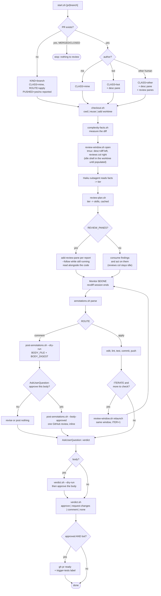

# Local PR review

Look at a PR or a branch in a local diff view, run review skills scaled to the
change, and act on what comes back.

Everything that can be decided without judgement is a script in `scripts/`. The
model's job is the three things that actually need a model: pick a complexity
tier from measured facts, run the skills the plan names, and act on the
annotations. Nothing else should be re-derived in prose — if you find yourself
inferring who wrote the PR or which base to diff against, read `$STATE` instead.

## The one hard rule: no unapproved prose on a PR

**Never post a summary comment the user hasn't read and approved first.** Not a
review body, not a verdict body, not a "posting this now" that they find out about
afterwards. Inline comments quote annotations they wrote; a summary is text *I*
wrote, published under their name, and it can't be unsent.

So every posting path is two calls:

1. `--dry-run` — publishes nothing, writes the rendered body to `BODY_FILE` and
   prints its `BODY_DIGEST`.
2. `Read` that file, show the user the body **verbatim** (in full — not
   paraphrased, not summarized), `AskUserQuestion` to approve it, then re-run with
   `--body-approved <BODY_DIGEST>`.

The digest is over the exact bytes that would be sent, so any rewording after
approval is refused — including a body the script itself changed, like file-level
notes folded in after the framing. If a refusal ever fires, the fix is to ask
again, never to re-derive the token. `--dry-run` here is a required step, not a
debugging nicety.

## The flow



## Step 1: one call for everything mechanical

```bash
scripts/start.sh [<pr-url|pr-number|branch>] [--repo owner/name]
```

Run it from inside the repo checkout. With no argument it resolves the PR for the
current branch, and falls back to branch mode when there is none. It resolves the
target, classifies the author, gets the code on disk, measures the diff, opens the
tmux window, and writes every fact to `$STATE`.

`eval` its output (or read `$STATE`) and keep these:

| key | meaning |
|---|---|
| `KIND` / `HAS_PR` / `PUSHED` | PR or local branch; is it on origin at all |
| `AUTHOR_CLASS` | `mine` \| `bot` \| `other` — drives every branch below |
| `ROUTE` | `apply` (edit locally) \| `comment` (post to GitHub) |
| `ITERATE` | is the fix-and-re-review loop allowed |
| `REVIEW_PANES` | show review output in panes, or consume it |
| `FACTS` | markdown diff measurements for Step 2 |
| `FRONTEND` | adds `frontend-conventions` to the plan |
| `OUT` / `DONE` | revdiff annotations file, and its completion sentinel |
| `CACHE_DIR` / `STATE` | per-head-SHA cache; the state file later calls read |
| `WORKTREE` / `MODE` | where the code is (`cwd` \| `reused` \| `created`) |

If it emits `STOP`, the PR is merged or closed. Say so and stop.

**Classification is the script's call, not yours.** `mine` means my own login;
`bot` covers `author.is_bot`, `[bot]` logins, known automation accounts
(`seer-by-sentry`, `renovate`, …) and `seer/`, `autofix/`, `renovate/`,
`dependabot/` branch prefixes; everything else is `other`. Extend the login list
with `$LPR_BOT_LOGINS` rather than special-casing in conversation.

The window is detached — it never steals focus. Tell the user it's open and that
`Ctrl-b w` gets them there.

## Step 2: pick a complexity tier (Haiku subagent)

Spawn one `claude` subagent with `model: haiku`. Give it the contents of `$FACTS`
and nothing else — not the diff. Ask for exactly one word:

> Read these diff measurements and answer with one word only:
> `trivial`, `small`, `medium`, `large`, or `risky`.
> - `trivial`: docs/comments/config only, or a few lines with no logic change
> - `small`: one concern, few files, no risky surfaces
> - `medium`: several files or a new code path
> - `large`: many files, new abstractions, or cross-cutting change
> - `risky`: touches auth, payments, secrets, migrations, or CI — regardless of size

Keeping the diff out of its context is what makes this cheap and reproducible.
`normalize_tier` accepts near-misses and maps anything unrecognized to `medium`,
so a fuzzy answer is safe: over-reviewing a small change is cheap, under-reviewing
a large one is not.

## Step 3: plan and run the review skills

```bash
scripts/review-plan.sh --tier <tier> --class "$AUTHOR_CLASS" --frontend "$FRONTEND" \
    --cache-dir "$CACHE_DIR" [--pr "$PR_NUMBER"] [--repo "$REPO"] \
    [--add <skill>] [--skip <skill>] [--only <skill>] [--refresh]
```

TSV out: `skill  runner  cache_path  hit|miss|skip  command  note`.

- `hit` — a report for this exact head SHA already exists. Read `cache_path`. Do
  not re-run it.
- `miss` + `runner=script` — `command` is runnable now and writes `cache_path`.
- `miss` + `runner=skill` — invoke `command` (a slash skill), then **write its
  report to `cache_path`** so the next pass over the same commit is a hit.
- `skip` — ruled out, with the reason in `note`. Don't work around it.
- A single `#` record means the tier plans nothing: reading the diff *is* the
  review at `trivial`.

Depth is a table, not a mood ([[feedback_scale_pr_review_depth]]): `small` →
`review`; `medium` → `review` + `meat-pr-review`; `large` → `deep-pr-review` +
`meat-pr-review`; `risky` → both plus `review`. Frontend diffs add
`frontend-conventions` at every tier above trivial. `simplify` is added only for
`mine`/`bot` — and refused for `other` even if you pass `--add simplify`, because
rewriting someone else's PR is not reviewing it.

**Run every `miss` at once, not one at a time.** Nothing in the plan reads
another entry's output, so paying for them serially only slows the review down.
In a single message:

- `runner=script` misses (`meat-pr-review`) — run directly with `Bash`.
- `runner=skill` misses that are report-only (`review`, `deep-pr-review`,
  `frontend-conventions`) — launch one `Agent` call per skill, each prompted to
  invoke `command` against `$WORKTREE` (plus `$PR_NUMBER`/`$REPO` when set) and
  write its report to `cache_path`.
- The one skill that mutates code (`simplify`, and only for `mine`/`bot`) is
  never part of that batch — it edits the same files the report-only skills are
  reading. Run it by itself, after the batch above finishes, so nothing reviews a
  half-edited tree.

Wait for the whole batch to return before Step 4 — panes and the apply step both
need finished files, not partial ones.

**At `large`/`risky`, verify before caching.** `review` and `deep-pr-review`
write raw findings first; before those land in `cache_path`, spawn one more
`Agent` per skill to adversarially check what it just found — try to refute each
finding, keep only what survives, and mark it confirmed. Write that filtered
report to `cache_path`, not the raw one. This is paid once per skill per head
SHA: a later `hit` reuses the verified report, so re-reviewing the same commit
doesn't pay for it twice.

The right-hand column of the window always exists — an idle shell in the
worktree from `review-window.sh open` until something lands there — so which
branch below fires only changes what appears in it, not whether it's there.

Then, by `REVIEW_PANES`:

- **`yes` (another human's PR)** — one pane per report, so they're read beside the
  code rather than summarized at the user. For a `miss` + `runner=script` entry
  the command redirects its own output to `cache_path`, so open the pane with
  `--follow` before or as soon as you launch it — the pane watches the file
  fill in instead of the user staring at an empty column while it runs:
  ```bash
  scripts/review-window.sh add-review-pane --state "$STATE" --file <cache_path> --label <skill> --follow
  ```
  For a `miss` + `runner=skill` entry there's nothing to stream — the report
  only exists once you've written it — so add the pane (without `--follow`)
  after writing `cache_path`. For a `hit`, same: the file's already whole.
  ```bash
  scripts/review-window.sh add-review-pane --state "$STATE" --file <cache_path> --label <skill>
  ```
- **`no` (mine or a bot's)** — read the reports yourself and fold their findings
  into the work in Step 5. Don't pane them; the column just stays the idle
  shell, which is a fine place to poke around the checkout by hand.

Either way, tell the user what ran and what it found **before** they start
annotating, so they're reading the code with the findings already in hand.

## Step 4: wait for the diff session, then parse

The user reads and annotates in the diff pane. Wait with a Monitor on the
sentinel — never a foreground poll:

```
Monitor: until [ -f "$DONE" ]; do sleep 1; done; echo "diff session finished"
```

`$DONE` holds revdiff's exit code (10 = annotations were written). Then:

```bash
scripts/annotations.sh summary "$OUT"   # one line, for reporting
scripts/annotations.sh parse   "$OUT"   # file  start  end  side  kind  text
```

`kind` is `question` or `directive`. **Questions are answered in chat and go
nowhere else** — not to GitHub, not into an edit. Asking myself "why is this
here?" and publishing that question on the author's PR are different acts.

If `$OUT` is empty there's nothing to route: go to Step 6.

## Step 5: route the directives

`ROUTE` already decided this. Don't re-decide it.

**`comment` (another human's PR):**

```bash
# 1. render, publish nothing
scripts/post-annotations.sh --pr "$PR_NUMBER" --out "$OUT" --repo "$REPO" \
    --commit "$HEAD_SHA" [--body "<framing>"] --dry-run
# 2. Read $BODY_FILE, show it verbatim, AskUserQuestion: Post it / Revise it / Don't post
# 3. only if they approved that text
scripts/post-annotations.sh --pr "$PR_NUMBER" --out "$OUT" --repo "$REPO" \
    --commit "$HEAD_SHA" [--body "<framing>"] --body-approved "$BODY_DIGEST"
```

Step 2 is not optional and not skippable when the framing looks obviously fine —
see [the hard rule](#the-one-hard-rule-no-unapproved-prose-on-a-pr). Pass the same
`--body` to both calls; a changed framing changes the digest and the post is
refused. "Revise it" means edit the framing and dry-run again. "Don't post" is a
complete outcome: the annotations stay local and Step 7 can still record a verdict.

One review with all the inline comments, not N separate comments — one
notification, in diff order, in one place. `(+)` lands on `RIGHT`, `(-)` on
`LEFT`, and file-level notes fold into the review body since GitHub has no line to
hang them on — which is why the body shown for approval is the rendered one from
`BODY_FILE`, not the framing you passed in. Pinning `--commit` means a push
mid-review gets the comments rejected rather than silently attached to lines that
moved. **Never edit the code in this branch of the flow.**

**`apply` (my own or a bot's):** make the edits, then check them —
`~/.claude/lint.sh` for lint errors ([[feedback_lint_script]]), typecheck, and the
tests that actually cover the change. Commit via the `commit` skill
([[feedback_commit_messages]]), then, for a PR:

```bash
git push origin HEAD:"$HEAD_REF"     # never force-push a bot's branch
```

This adds a commit on top; it doesn't rewrite the bot's history. Pushing fixes is
not approving — the ready/label step stays gated on Step 7.

## Step 6: iterate

Only when `ITERATE=yes` (`mine` or `bot`) and something changed:

```bash
scripts/review-window.sh relaunch --state "$STATE"
```

Fresh revdiff in the *same* pane — the window keeps its identity, its place in the
window list, and the description/review panes beside it. `ITER` increments and
`$OUT`/`$DONE` become new paths, so re-read them from the output (or `$STATE`)
rather than reusing the old ones. Then repeat Steps 4–6 until a session ends with
no new annotations.

`scripts/review-window.sh status --state "$STATE"` reports panes and whether
revdiff is still open, if the state is ever unclear.

## Step 7: verdict

Use `AskUserQuestion` — not a plain text question — offering exactly:
**Approve**, **Request changes**, **Comment only**, **No verdict**. Summarize
what ran, what was found, and what was done with the annotations first, so the
choice is informed. Then:

```bash
scripts/verdict.sh --pr "$PR_NUMBER" --repo "$REPO" --class "$AUTHOR_CLASS" \
    --verdict approve|request-changes|comment|none [--body "<text>"] --dry-run
# then show the body verbatim, get approval, and re-run with:
#   --body-approved "$BODY_DIGEST"
```

**Picking the verdict is not approving the wording.** Choosing "Request changes"
answers *what* to say, not *how*; the body you then draft is unapproved prose and
the script refuses it without a matching digest. Two questions, in order: the
verdict, then the body — a second `AskUserQuestion` with the full text above it.
A verdict with no body (`none`, or a bare `approve`) publishes no prose and needs
no second question.

- `none` posts nothing. It's a real outcome, not a failure to decide.
- `request-changes` requires `--body` — say what to change.
- `approve` + `--class mine` degrades to a comment (`DEGRADED=yes`): GitHub won't
  let you approve your own PR.
- **Approved + `bot` only:** the script also runs `gh pr ready` and adds
  `Trigger: getsentry tests` (override with `$LPR_TEST_LABEL`). This is the one
  place the flow changes shared state — CI spend and the review queue — so it's
  gated strictly on a human approving. It fires for no other class and no other
  verdict.

## Step 8: leave things tidy

Report what the review found, where the cached reports are (`$CACHE_DIR`), and
what was posted or pushed. Then:

- `scripts/review-window.sh close --state "$STATE"` closes the tmux window —
  only once the user says they're done looking.
- `MODE=created` means a worktree was added at `$WORKTREE`. Leave it unless the
  user asks; `git worktree remove` is theirs to run, and it may hold work.
- The cache is keyed by head SHA, so re-running this flow on the same commit
  reuses the reports and re-running after a push does not.

## Scripts

| script | does |
|---|---|
| `start.sh` | Steps 1's whole chain in one call; writes `$STATE` |
| `pr-context.sh` | PR-or-branch, pushed?, author class, and every routing decision |
| `classify.sh` | the pure decision table (sourced, side-effect free, fully tested) |
| `checkout.sh` | code on disk: current checkout, existing worktree, or a new one |
| `complexity-facts.sh` | measures the diff into the markdown the Haiku pass reads |
| `review-plan.sh` | tier → skills → cache paths → hit/miss/skip |
| `review-window.sh` | `open` / `relaunch` / `add-review-pane` / `status` / `close` |
| `annotations.sh` | `parse` / `summary` of revdiff's annotation file |
| `post-annotations.sh` | annotations → one GitHub review with inline comments |
| `verdict.sh` | the verdict, plus the bot-only ready + label follow-through |
| `lib.sh` | shared helpers, including the `--body-approved` digest gate |

Tests: `classify.test.sh`, `annotations.test.sh`, `review-plan.test.sh`,
`body-approval.test.sh` — plain bash, no network, no repo. Run all four before
changing the routing table or anything on a posting path.

## Notes

- Range detection is delegated to the `diff` skill's `detect-range.sh`, so the
  facts, the diff pane, and the review all describe the same range.
- `--dry-run` on `post-annotations.sh` and `verdict.sh` is how every real post
  starts, on any PR — it's the call that produces the `BODY_DIGEST` the post
  requires, so there is no path that publishes prose in one call.
- `glow` isn't installed here; the markdown panes fall back to `bat`. Either way
  the pane is a pager, not an editor.
- `gh pr ready` on an already-ready PR is a no-op, not an error.
- Running several of these reviews at once is normal and each gets its own
  worktree, window, and cache dir. But `large`/`risky` tiers now fan out multiple
  `Agent` calls per review (Step 3's batch, plus the verify pass), and
  `deep-pr-review` fans out further inside its own call — so stagger how many
  `large`/`risky` reviews run concurrently rather than starting a dozen at once.
  `trivial`/`small` reviews are cheap enough to run with much higher concurrency.
